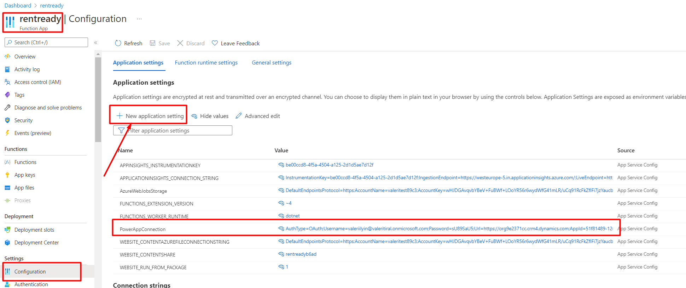

# RentReadyFunction

Тестовый проект для реализации работы с таблицей TimeEntry в PowerApp. Реализовано в виде Azure Function (.Net 6)     

### Проекты входящие в Solution
##### RentReady.Server
  Серверная логика. Ключевые классы бизнес логики:
- TimeEntryCreator
- TimeEntryRepository
- TimeIntervalParser

##### RentReady.Client
  Небольшой клиент, позволяющий посылать запросы в функцию. Создан для тестирования

##### RentReady.Test
Unit и интеграционные тесты. Интеграционные тесты по умолчанию смотрят на мой инстанс PowerApp. Чтобы поменять его - поменяйте ключ PowerAppConnection  
в файле appsettings.json

##### RentReadyFunction
Непосредственно функция. При запуске локально функция смотрит на мой инстанс PowerApp. Чтобы поменять его - поменяйте ключ PowerAppConnection  
в файле local.settings.json
Фнукция подготовлена к деплойменту в инстанс, созданный на моем тестовом хостинге. Где сейчас и расположена.
Этот URL рабочий и принимает запросы без авторизации:

https://rentready.azurewebsites.net/api/TimeEntryFunction

Чтобы продеплоить в этот инстанс, достаточно в Visual Studio у проекта RentReadyFunction в контекстном меню выбрать "Publish..." 
Далее нажать "Publish" в появившемся окне.

#### Публикация RentReadyFunction в новый инстанс

1. Создайте новый Azure Function инстанс в portal.azure.com на нужном аккаунте
2. Продеплойте в него RentReadyFunction: у проекта RentReadyFunction в контекстном меню выбрать "Publish..."
   Далее нажать "New" в появившемся окне и следовать пошаговой инструкции в этом окне.
3. После публикации функции идем в portal.azure.com в созданную нами функцию. Там нужно добавить ключ PowerAppConnection в Application Setting.  
В качестве значения должна быть connection string в PowerApp. Ниже представлен connection string в мой тестовый инстанс PowerApp. Можете использовать его либо ввести connection string к вашему инстансу PowerApp.

   `AuthType=OAuth;Username=valeriilyin@valeritiral.onmicrosoft.com;Password=sU89SaU5;Url=https://org9e2371cc.crm4.dynamics.com;AppId=51f81489-12ee-4a9e-aaae-a2591f45987d;RedirectUri=app://58145B91-0C36-4500-8554-080854F2AC97;LoginPrompt=None`
4. Ключ PowerAppConnection добавляем здесь через "New Application Settings". Не забудьте нажать Save после добавления ключа   
   
5. Все. теперь функция должна работать. 

